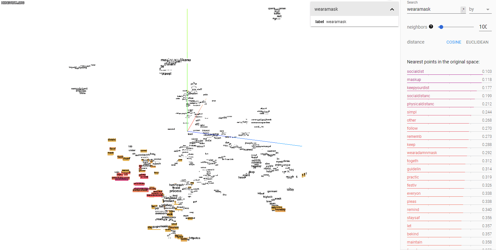

# Understanding Public Attitudes Toward COVID-19 with Twitter

This is a capstone project for Master of Science in Data Science (MSDS) at Univeristy of Virginia School of Data Science (UVA SDS).
The following t-SNE visualizations for word embeddings are created with the [TensorBoard Embedding Projector](http://projector.tensorflow.org/).
You can recreate and explore it yourself by loading `eng_w2v_tensor.tsv` and `eng_w2v_metadata.tsv` in **tensor** folder.

